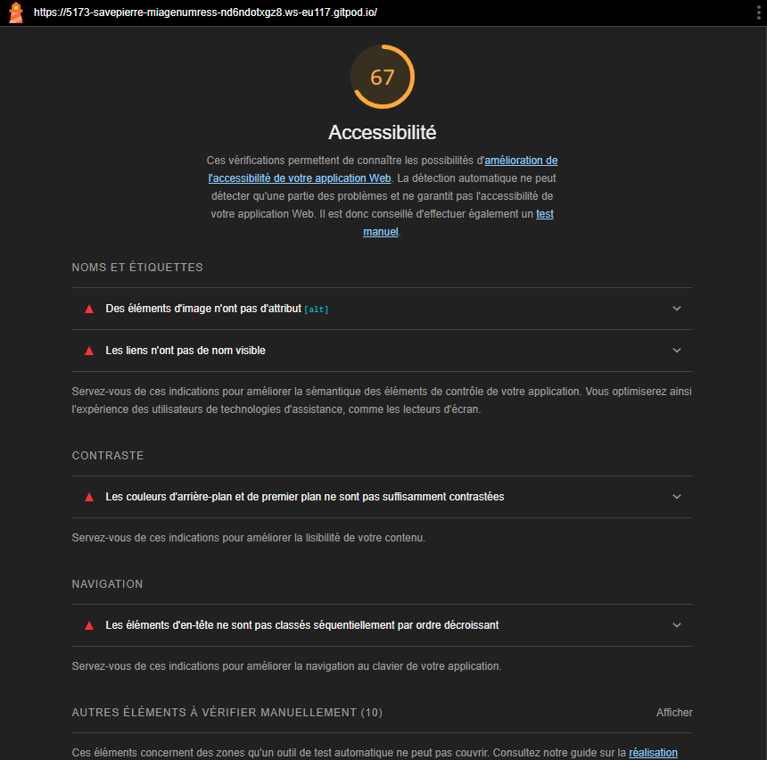
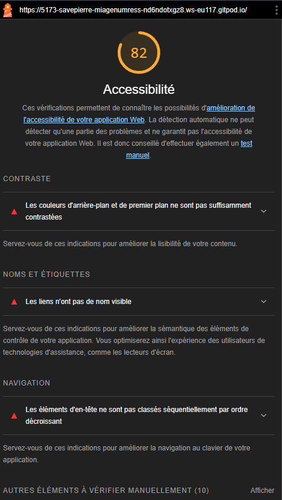

# Q1: Quels sont les arguments que vous pouvez utiliser pour convaincre votre Client de rendre son quizz accessible ? (Vous pouvez vous aider du cour)
Réponse:

Rendre un quiz accessible permet à tout le monde, y compris les personnes en situation de handicap, de l’utiliser facilement. Cela élargit l’audience et augmente les chances de succès. En plus, respecter les normes d’accessibilité évite des problèmes juridiques et améliore l’image de l’entreprise. Enfin, c’est une démarche éthique qui montre un engagement envers l’inclusion et la responsabilité sociale.

# Q2: Ajouter le screen de votre score :
Screen:

# Q3: Est-ce que l'analyse de Lighthouse est suffisante pour évaluer l'Accessibilité de votre Application ?
Réponse:

Non, l’analyse de Lighthouse seule n’est pas suffisante pour évaluer l’accessibilité d’une application. Elle détecte certains problèmes techniques, mais des tests manuels et avec des utilisateurs réels sont nécessaires pour identifier des aspects plus subtils et garantir une accessibilité complète.

# Q4: Combien de fois vous devez utiliser une touche du clavier pour passer le quizz ?
Réponse:

22 clicks (alt)

# Q5: Donner 3 roles ARIA et 3 propriété ARIA
Réponse:

Rôles :

role="button" : Définit un élément comme un bouton interactif.
role="alert" : Annonce un message important ou urgent aux utilisateurs.
role="dialog" : Définit une boîte de dialogue modale ou non modale.

Prooriété :

aria-label : Fournit une description textuelle pour un élément interactif.
aria-expanded : Indique si un élément (comme un menu ou un panneau) est ouvert ou fermé.
aria-hidden : Spécifie si un élément est visible ou caché pour les technologies d’assistance.

# Q6: Ajouter le screen de votre score Lighthouse
Screen:

# Q7: L'une des best practice de l'ARIA est "ne pas utiliser l'ARIA" pouvez nous expliquer pourquoi d'après vous ?
Réponse:

"Ne pas utiliser l'ARIA" signifie qu'il vaut mieux utiliser le HTML natif, qui est déjà accessible. L'ARIA doit être utilisée seulement si le HTML ne permet pas de répondre aux besoins d'accessibilité.

# Q8: Ajouter le screen de votre score Lighthouse
Screen:

# Q9: Pourquoi le score de lighthouse n'a pas augmenté d'après vous ?
Réponse:

Le score de Lighthouse n’a pas augmenté car certains problèmes d’accessibilité, comme des contrastes insuffisants ou des balises mal utilisées, peuvent toujours être présents. Lighthouse ne détecte pas tout et nécessite aussi des tests manuels pour évaluer certains aspects.

# Q10: Quel est la valeur du rapport de contraste actuel :
Réponse:

# Q11: Quel est la valeur du score AA :
Réponse:

# Q12: Quel est la valeur du score AAA :
Réponse:

# Q13: Comment pouvez vous changer la valeur du contraste de votre texte ?
Réponse:

# Q14: Ajouter le screen de votre score Lighthouse
Screen:

# Q15: Êtes vous capable de déterminer visuellement ce qui est un lien ou pas en appliquant chaque altérations ?
Réponse:

# Q16: Ajouter le screen de votre score Lighthouse
Screen:

# Q17:  Proposition 1
Description:
Nb d'actions gagnée : 

# Q18:  Proposition 2
Description:
Nb d'actions gagnée : 

# Q19:  Proposition 3
Description:
Nb d'actions gagnée : 
